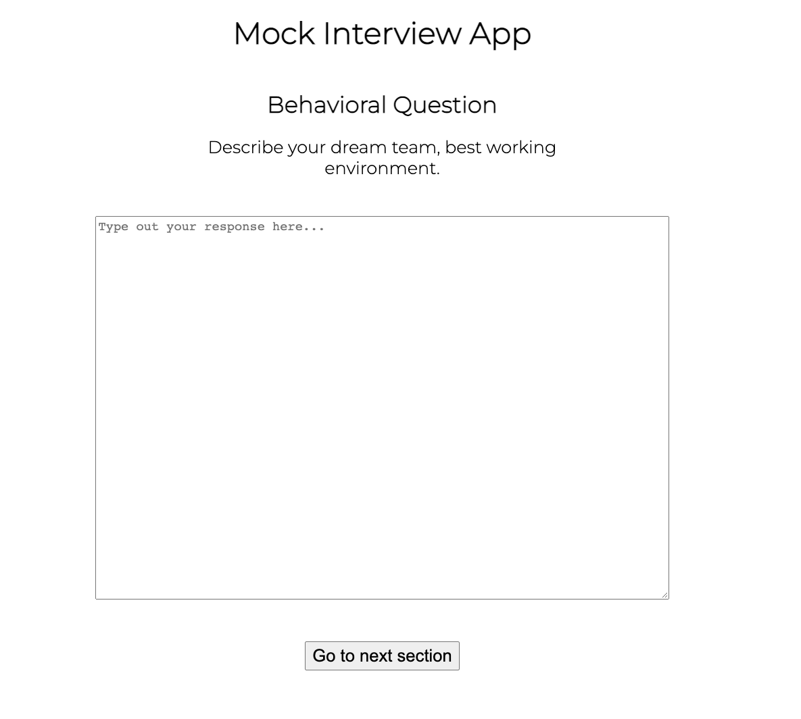
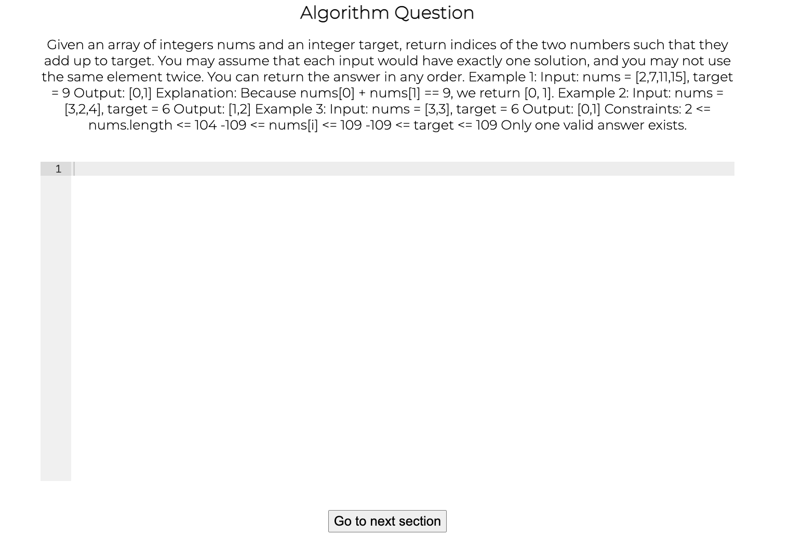
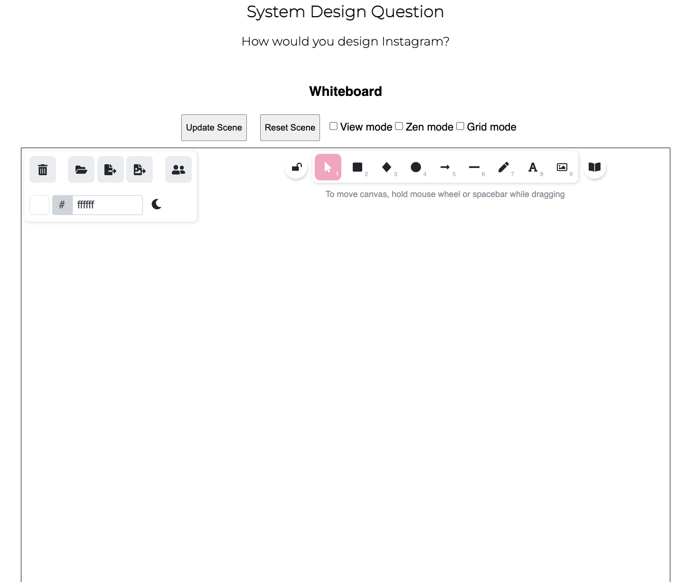

# Mocked

Have an interview coming up but can't find a partner to practice with?

Use our Mock Interview App to simulate real interviews as many times as you
want!

## How to use

After creating an account and signing in, the app will automatically generate
three random questions for you to solve in your mock interview.

After completing a question, click the 'Go to next section' button to receive
your next question.

When you are finished, you can reset and start over if you'd like!

Happy practicing!

## User Interface

## Authors

Finley Decker: [GitHub](https://github.com/finleydecker) |
[LinkedIn](https://www.linkedin.com/in/finleydecker/)

Alex Law: [GitHub](https://github.com/alexlaw528) |
[LinkedIn](https://www.linkedin.com/in/alexlaw528/)

Jane You: [GitHub](https://github.com/janeyou94) |
[LinkedIn](https://www.linkedin.com/in/janeyou-pharmd-bcacp/)

Eddie Wu: [GitHub](https://github.com/edi-wu) |
[LinkedIn](https://www.linkedin.com/in/edi-wu/)

